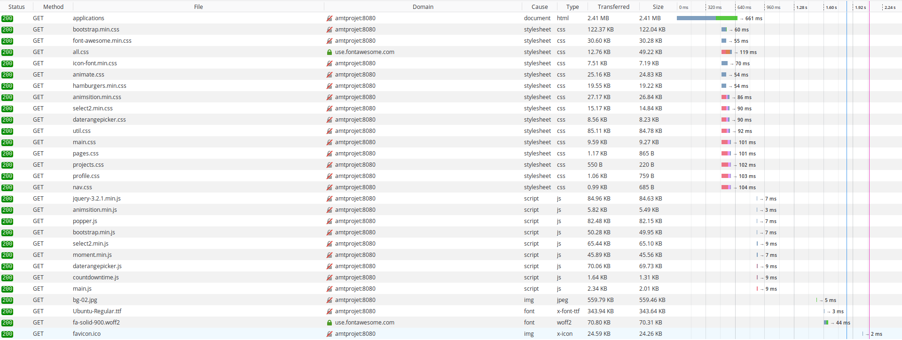
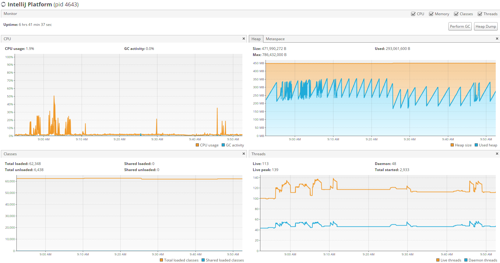
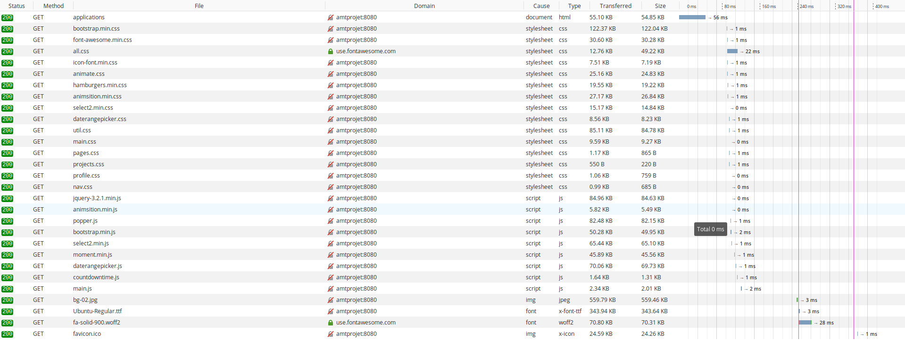

Gestion de la pagination

### Problème sans pagination

Sans la pagination, la page devrait télécharger l'intégralité des informations de la base de données et les afficher sur une seule page ce qui rendrait le chargement très long, les données à gérer très lourdes et surchargerait visuelement la page.

### Utilité de la pagination

La pagination permet de diminuer les quantités affichées sur une page ce qui en allège le contenu et le rend plus lisible. Suivant l'implémentation, on peut agir sur la requête faite à la base de données pour alléger la réponse en diminuant la quantité de données demandées par la page et par conséquent diminuer le temps de chargement.

### Test sur la pagination

Pour tester cela, on a fait un script bash pour générer des entrées SQL :

```bash
#!/bin/bash
echo "INSERT INTO tbProject (projectName, projectDescription, projectCreationDate, APIKey, APISecret)
         VALUES" >> insertfile.txt

for((i=1; i<=50000; i++))
   do echo "('ApplicationTest"$i"', 'Description ', NOW(),"$i", 'a"$i"'),">> insertfile.txt
done

echo "('ApplicationTest"$i"', 'Description ', NOW(),50001, 'a50001');">> insertfile.txt

echo "INSERT INTO tbUserProject (userId, projectId) VALUES" >> insertfile.txt

for((i=1; i<=50000; i++))
   do echo "('2','"$i"'),">> insertfile.txt
done
echo "('2','50001');">> insertfile.txt
echo "terminé"
```

**Pour l'utiliser :** 

1. Rendez ce fichier exécutable : `chmod a+x <monscript>`
2. Exécutez son script `./<monscript>`
3. Ouvrez le script de base de données `02-AMTProjectDatabaseInsert.sql`
   - enlever les inserts dans `tbProject` et dans `tbUserProject`
4. Envoyez les données générées dans `02-AMTProjectDatabaseInsert.sql`
   - Pour cela : `cat insertfile.txt >> 02-AMTProjectDatabaseInsert.sql`


### Avec une pagination côté servlet

La pagination côté servlet signifie que l'on charge toutes les applications de l'utilisateur concerné à chaque rafraichissement de page ou changement de page.

Ici on test avec 50'000 applications générées et 10 applications par page. 




On voit que le chargement entier se termine après environ 500ms.

Plus précisément, il faut 234ms pour charger le contenu de la page applications.

Etat de mes resources lors de ce test, mais rien n'est très parlant.




### Avec une pagination SQL

La pagination SQL signifie que l'on charge seulement les applications que l'on veut afficher pour la page courante.

Ici on test avec 50'000 applications générées et 10 applications par page. 




On voit que le chargement entier se termine après environ 400ms. Ce qui ne fait pas une grande différence.

Par contre, si on regarde que la partie chargement de la page applications, là on dimininue fortement le temps de chargement qui descent à 56ms.

#### Avec 2 applications par page : 

Avec seulement 2 applications chargée par page, la différence est minimum par rappot à 10 applications par page.


#### Avec 30 applications par page :

Avec seulement 30 applications chargée par page, le temps de chargement est légérement plus long mais de peu.


### Conclusion

Première conclusion, les valeurs de temps de chargement des pages vérifie le chargement des applications depuis la base de données et aussi l'affichage du DOM de la page. Le jsp a été le même pour chaque test mais si on affiche plus ou moins d'applications, le chargement peut en être impacté.

Deuxièmement, l'amélioration que l'on a fait sur la pagination en passant d'une pagination côté servlet à une pagination côté SQL à bel et bien amélioré le temps de réponse.

Troisièment, plus la base de données est remplie, plus cette différence sera visible. Nous pensons aussi que si nous passions par le réseau entre la base de données et notre code et non pas en local, ces différences seraient plus marquées.

### Code de pagination serveur

On remarque que l'on récupère toutes les applications de la base de données pour chaque requête Get.

```java
protected void doGet(javax.servlet.http.HttpServletRequest request, javax.servlet.http.HttpServletResponse response) throws ServletException, IOException {
    new VerifySession(request.getSession(), request, response).redirectIfNoUser();

    HttpSession session = request.getSession();
    User currentUser = (User)session.getAttribute("user");

    // Test if the request come from the admin View, if yes there is some query string defined and that's mean we
    // we want to see the application of an other user.
    // else we take our application
    try {
        if (request.getParameterMap().containsKey("showUser") && request.getParameterMap().containsKey("userEmail") && request.getParameter("showUser").equals("SHOWUSER") && currentUser.isAdmin()) {

            applications = applicationDAO.getProjectsByUser(request.getParameter("userEmail"));
        } else {
            applications = applicationDAO.getProjectsByUser(currentUser.getEmail());
        }
    }catch (Exception e){
        request.setAttribute("error","There was a problem when we get the project of the user");
        request.setAttribute("errorContent",e.getMessage());
        request.getRequestDispatcher(ErrorServlet.ERROR).forward(request, response);
    }

    pagination = new Pagination(1,1);

    //PAGINATION
    int recordPerPage = 10;

    // define number of applications per page
    pagination.setRecordsPerPage(recordPerPage, applications.size());

    // define if a page is choose
    if(request.getParameter("value") != null)
        pagination.setCurrentPage(Integer.parseInt(request.getParameter("value")));

    // define position of first Element and last element
    int firstElement = pagination.getFirstElement();
    int lastElement = pagination.getLastElement(applications.size());

    // define a sublist with element to show
    List<Application> tempList = applications.subList(firstElement,lastElement);

    int noOfRecords = applications.size();
    int noOfPages = (int)Math.ceil(noOfRecords * 1.0 / pagination.getRecordsPerPage());

    request.setAttribute("isAdmin", currentUser.isAdmin());
    request.setAttribute("applications", tempList);
    request.setAttribute("noOfPages", noOfPages);
    request.setAttribute("currentPage", pagination.getCurrentPage());

    // We give the attributes comming from the admin part (there will be tested if empty in the jsp file

    request.setAttribute("showUser", request.getParameter("showUser"));
    request.setAttribute("userEmail", request.getParameter("userEmail"));

    request.getRequestDispatcher(VUE).forward(request, response);
}
```


### Code de pagination SQL

```java
protected void doGet(javax.servlet.http.HttpServletRequest request, javax.servlet.http.HttpServletResponse response) throws ServletException, IOException {
    new VerifySession(request.getSession(), request, response).redirectIfNoUser();

    HttpSession session = request.getSession();
    User currentUser = (User)session.getAttribute("user");

    //PAGINATION
    int recordPerPage = 10;

    if(request.getParameter("value") != null) {
        currentPage = Integer.parseInt(request.getParameter("value"));
    }else{
        currentPage = 1;
    }

    String email = currentUser.getEmail();
    int noOfRecords = 0;

    // Test if the request come from the admin View, if yes there is some query string defined and that's mean we
    // we want to see the application of an other user.
    // else we take our application
    try {
        if (request.getParameterMap().containsKey("showUser") && request.getParameterMap().containsKey("userEmail") && request.getParameter("showUser").equals("SHOWUSER") && currentUser.isAdmin()) {
            email = request.getParameter("userEmail");
        }

        System.out.print("currentpage : " + currentPage + "records per page " + recordPerPage);
        applications = applicationDAO.getAppByPage(email, currentPage, recordPerPage);
        noOfRecords = userDAO.countNumbersApplications(email);

    }catch (Exception e){
        request.setAttribute("error","There was a problem when we get the project of the user");
        request.setAttribute("errorContent",e.getMessage());
        request.getRequestDispatcher(ErrorServlet.ERROR).forward(request, response);
    }


    int noOfPages = (int)Math.ceil(noOfRecords * 1.0 / recordPerPage);

    request.setAttribute("isAdmin", currentUser.isAdmin());
    request.setAttribute("applications", applications);
    request.setAttribute("noOfPages", noOfPages);
    request.setAttribute("currentPage", currentPage);

    // We give the attributes comming from the admin part (there will be tested if empty in the jsp file

    request.setAttribute("showUser", request.getParameter("showUser"));
    request.setAttribute("userEmail", request.getParameter("userEmail"));

    request.getRequestDispatcher(VUE).forward(request, response);
}
```