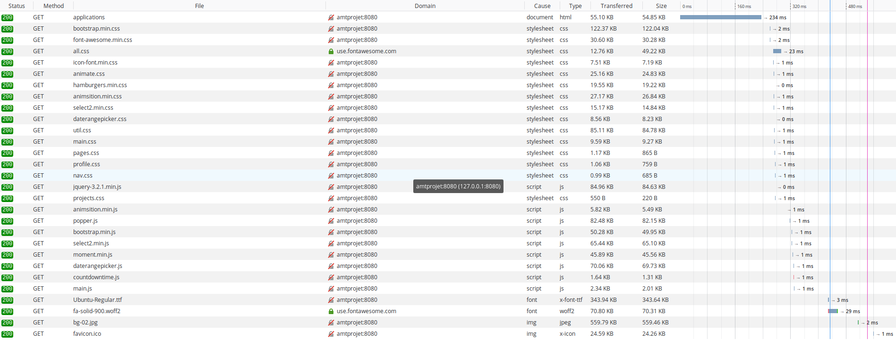

# Gestion de la pagination

### Problème sans pagination

Sans la pagination, la page devrait télécharger l'intégralité des informations de la base de données et les afficher sur une seule page ce qui rendrait le cahrgement très long, les données à gérer très lourdes et surchargerait visuelement la page.

### Utilité de la pagination

La pagination permet de diminuer les quantités affichées sur une page ce qui en allège le contenu et le rend plus lisible. Suivant l'implémentation, on peut agir sur la requête faite à la base de données pour alléger la réponse en diminuant la quantité de données demandées par la page et par conséquent diminuer le temps de chargement.

### Implémentation de la pagination :

- Pour implémenter la pagination, une classe `Pagination` a été créée permettant de garder le numéro de la page courante ainsi que le nombre d'éléments la composant.

- Le code qui suit a été ajouté dans les Servlets gérant les pages avec de la pagination. Il permet de n'afficher sur la page que `recordPerPage` éléments.

```java
  pagination = new Pagination(1,1);

  //PAGINATION
  int recordPerPage = 10;

  // define number of applications per page
  pagination.setRecordsPerPage(recordPerPage, applications.size());

  // define if a page is choose
  if(request.getParameter("value") != null)
      pagination.setCurrentPage(Integer.parseInt(request.getParameter("value")));

  // define position of first Element and last element
  int firstElement = pagination.getFirstElement();
  int lastElement = pagination.getLastElement(applications.size());

  // define a sublist with element to show
  List<Application> tempList = applications.subList(firstElement,lastElement);

  int noOfRecords = applications.size();
  int noOfPages = (int)Math.ceil(noOfRecords * 1.0 / pagination.getRecordsPerPage());

  request.setAttribute("applications", tempList);
  request.setAttribute("noOfPages", noOfPages);
  request.setAttribute("currentPage", pagination.getCurrentPage());

```

### Résultat de la pagination :

- On demande au serveur uniquement la partie des applications ou des users que l'on veut afficher et l'on voyage dans les différentes pages pour avoir accès au reste des informations.


### Test sur la pagination

Pour tester cela, on a fait uns script un script bash pour générer des entrée SQL :

```bash
#!/bin/bash
echo "INSERT INTO tbProject (projectName, projectDescrition, projectCreationDate, APIKey, APISecret)
         VALUES" >> insertfile.txt

for((i=1; i<=50000; i++))
   do echo "('ApplicationTest"$i"', 'Description ', NOW(),"$i", 'a"$i"'),">> insertfile.txt
done

echo "('ApplicationTest"$i"', 'Description ', NOW(),50001, 'a50001');">> insertfile.txt

echo "INSERT INTO tbUserProject (userId, projectId) VALUES" >> insertfile.txt

for((i=1; i<=50000; i++))
   do echo "('2','"$i"'),">> insertfile.txt
done
echo "('2','50001');">> insertfile.txt
echo "terminé"
```

**Pour l'utiliser :** 

1. rendre ce fichier exécutable : `chmod a+x <monscript>`
2. exécuter son script `./<monscript>`
3. ouvrez le script de base de donnée `02-AMTProjectDatabaseInsert.sql`
   - enlever les insert dans `tbProject` et dans `tbUserProject`
4. Envoyez les données générée dans `02-AMTProjectDatabaseInsert.sql`
   - Pour cela : `cat insertfile.txt >> 02-AMTProjectDatabaseInsert.sql`


### Avec une pagination côté serveur

La pagination côté serveur signifie que l'on charge toutes les applications de l'utilisateur concerné à chaque rafraichissement de page ou changement de page.

Ici on test avec 50'000 applications générées. 



On voit que le chargement se termine après environ 2ms. Ce qui fait quand même pas mal de temps pour l'affichage de simple texte.

Etat des mes resources lors de ce test, mais rien n'est très parlant.


### Avec une pagination SQL


### Code de pagination serveur

On remarque que l'on récupère toutes les applications de la base de donnée pour chaque requête Get.

```java
protected void doGet(javax.servlet.http.HttpServletRequest request, javax.servlet.http.HttpServletResponse response) throws ServletException, IOException {
    new VerifySession(request.getSession(), request, response).redirectIfNoUser();

    HttpSession session = request.getSession();
    User currentUser = (User)session.getAttribute("user");

    // Test if the request come from the admin View, if yes there is some query string defined and that's mean we
    // we want to see the application of an other user.
    // else we take our application
    try {
        if (request.getParameterMap().containsKey("showUser") && request.getParameterMap().containsKey("userEmail") && request.getParameter("showUser").equals("SHOWUSER") && currentUser.isAdmin()) {

            applications = applicationDAO.getProjectsByUser(request.getParameter("userEmail"));
        } else {
            applications = applicationDAO.getProjectsByUser(currentUser.getEmail());
        }
    }catch (Exception e){
        request.setAttribute("error","There was a problem when we get the project of the user");
        request.setAttribute("errorContent",e.getMessage());
        request.getRequestDispatcher(ErrorServlet.ERROR).forward(request, response);
    }

    pagination = new Pagination(1,1);

    //PAGINATION
    int recordPerPage = 10;

    // define number of applications per page
    pagination.setRecordsPerPage(recordPerPage, applications.size());

    // define if a page is choose
    if(request.getParameter("value") != null)
        pagination.setCurrentPage(Integer.parseInt(request.getParameter("value")));

    // define position of first Element and last element
    int firstElement = pagination.getFirstElement();
    int lastElement = pagination.getLastElement(applications.size());

    // define a sublist with element to show
    List<Application> tempList = applications.subList(firstElement,lastElement);

    int noOfRecords = applications.size();
    int noOfPages = (int)Math.ceil(noOfRecords * 1.0 / pagination.getRecordsPerPage());

    request.setAttribute("isAdmin", currentUser.isAdmin());
    request.setAttribute("applications", tempList);
    request.setAttribute("noOfPages", noOfPages);
    request.setAttribute("currentPage", pagination.getCurrentPage());

    // We give the attributes comming from the admin part (there will be tested if empty in the jsp file

    request.setAttribute("showUser", request.getParameter("showUser"));
    request.setAttribute("userEmail", request.getParameter("userEmail"));

    request.getRequestDispatcher(VUE).forward(request, response);
}
```