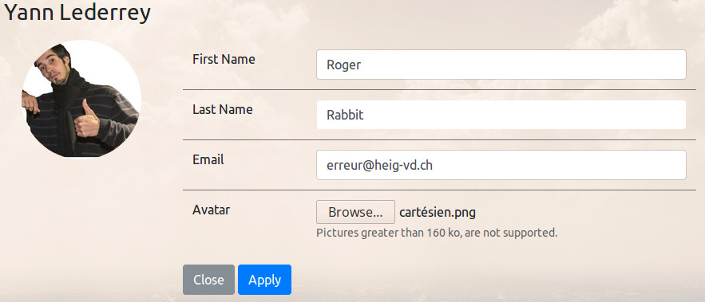
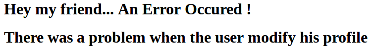
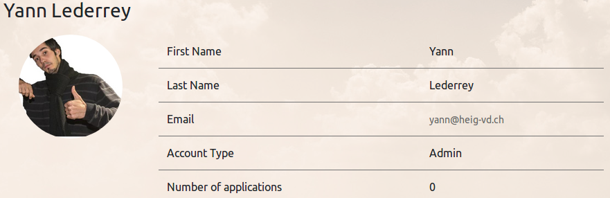

# Gestion des transactions


### Implémentation de la gestion des transactions :

- Pour gérer les transaction nous avons utilisé l'annotation suivante :

  `@TransactionAttribute(TransactionAttributeType.REQUIRES_NEW)`

- Nous avons choisi de throw les runtimesExceptions de nos DAO afin de les "Catch" dans nos servlet pour rediriger l'utilisateur sur une page d'erreur.


### Erreur générée : 

Dans la méthode `updateEmail` du `UserDAO.java` j'ai manuellement throw une excecption:

```java
@Override
public void updateEmail(Long id, String email) {
    try (Connection connection = dataSource.getConnection()) {
        PreparedStatement ps = connection.prepareStatement(updateUserEmail);

        // insert data into statement.
        ps.setString(1, email);
        ps.setLong(2, id);

        ps.execute();
    } catch (SQLException e) {
        throw new RuntimeException(e);
    }
    throw new RuntimeException("EXPLOSSSSIONNN");
}
```

Cette méthode est utilisée dans la méthode `updateProfile` du `UserDAO`

```java
public void updateProfil(User currentUser, InputStream is, Boolean changeAvatar, String email, String firstName, String lastName){
    if(changeAvatar)
        updateAvatar(currentUser.getId(), is);
    updateEmail(currentUser.getId(), email);
    updateName(currentUser.getId(), firstName, lastName);
}
```

Cette dernière méthode est utilisée dans le `ProfileServlet.java`

```java
case "MODIFY":
    try {
        String firstName = request.getParameter("firstName");
        String lastName = request.getParameter("lastName");
        String email = request.getParameter("email");

        Boolean changeAvatar = false;
        InputStream is = null;
        Part filePart = request.getPart("avatar");
        String fileName = Paths.get(filePart.getSubmittedFileName()).getFileName().toString();
        InputStream fileContent = filePart.getInputStream();

        if (fileName != null && !fileName.isEmpty()) {

            BufferedImage sourceImage = ImageIO.read(fileContent);
            ByteArrayOutputStream os = new ByteArrayOutputStream();
            ImageIO.write(sourceImage, "jpeg", os);
            long imgSize = os.size();

            is = new ByteArrayInputStream(os.toByteArray());

            if (imgSize < 50000) {
                changeAvatar = true;
            }
        }

        // if new inserted email already exists we prevent a runtime error at database insert and inform the user to change it.
        if (!userDAO.isExist(email) || currentUser.getEmail().equals(email)) {
            userDAO.updateProfil(currentUser, is, changeAvatar, email, firstName, lastName);
        } else {

            User user = userDAO.findById(currentUserId);
            user.setEmail(email);
            request.setAttribute("currentUser", user);

            String emailError = "This email already exists";
            request.setAttribute("emailError", true);
            request.setAttribute("emailErrorText", emailError);
            request.setAttribute("modify", true);
            request.getRequestDispatcher(PROFILE).forward(request, response);
        }

        //Mettre à jour la session en fonction du changement de profil
        currentUser.setName(firstName);
        currentUser.setLastName(lastName);
        currentUser.setEmail(email);
        session.setAttribute("user", currentUser);
    } catch (Exception e) {
        request.setAttribute("error", "There was a problem when the user modify his profile");
        request.setAttribute("errorContent", e.getMessage());
        request.getRequestDispatcher(ErrorServlet.ERROR).forward(request, response);
    }
    break;
```

### Resumé du test :

Lors que l'on est sur la page `Profile` et qu'on modifie son profile, si on modifie l'email de l'utilisateur . L'erreur précédement ajoutée dans la méthode `updateEmail` va throw une exception et nous seront redirigé sur la page d'erreur. Ensuite si on revient sur la page de profile, on remarque que la transaction  bien eu lieu et que l'email n'a pas été modifié ainsi que les autres champs.

### Etapes des tests avec screenshots

1. On se connecte et on va sur la page : http://amtprojet:8080/amtprojetRemote/profile

2. On clic sur "Modify Profile"

3. Valeurs initiales : 

   

4. Formulaire après modification : 

   

5. On clic sur "Apply" On sait qu'un erreur va être levée dans l'application du changement d'email.

6. On arrive sur la page suivante : 

   

7. Ensuite si on retourne sur la page de profile, on remarque que les valeurs n'ont pas été modifiée et donc le rollback à fonctionné :

   

