# Enable JDBC in Payara Server

### Librairie à télécharger

* aller sur https://dev.mysql.com/downloads/connector/j/
* choisi "Platform Independant" ensuite "Go to Download Page >"
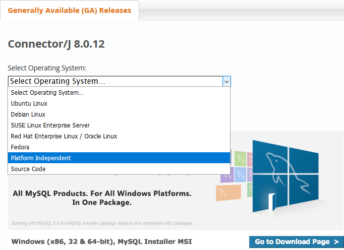
* choisi l'archive que tu veux et télécharge là
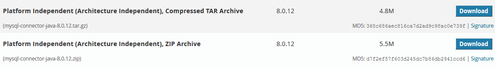
* dans cet archive prendre mysql-connector-java-x.x.x.jar
* l'extraire dans "payaraX\javadb\lib\"

### Partie serveur

* lancer le serveur payara
* aller sur la page admin par défaut http://localhost:4848/
* puis onglet ressource > JDBC > JDBC Connection Pool
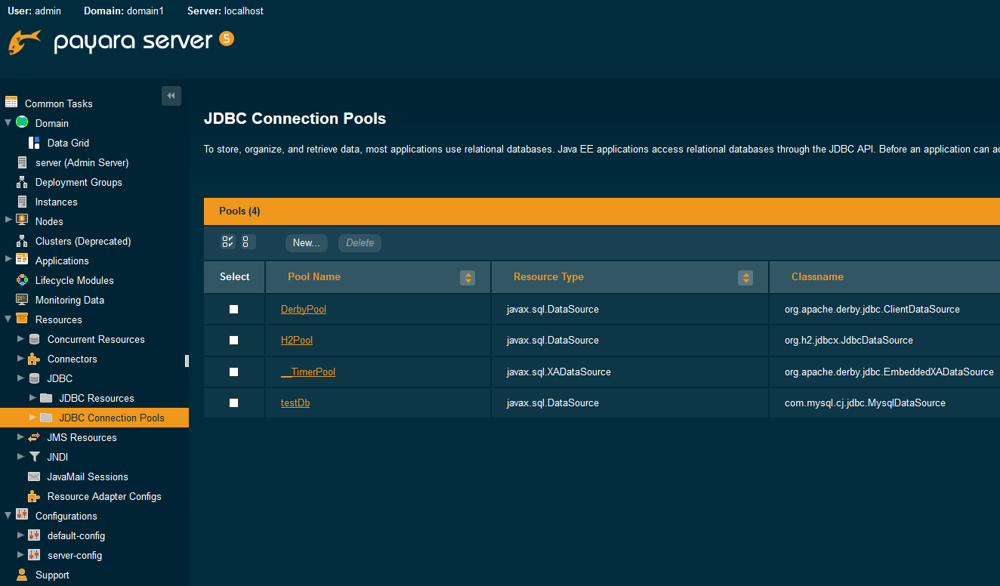
* cliquer sur new
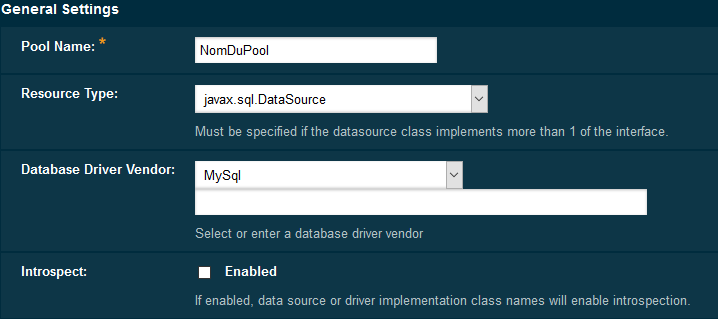
* puis next et finish
* il apparait
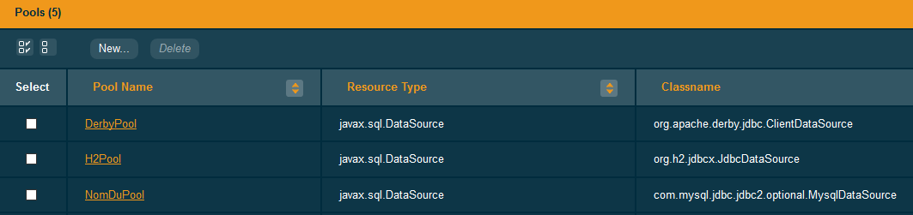
* sélectionner "NomDuPool"
* changer le " Datasource Classname:" 
  * "com.mysql.jdbc.jdbc2.optional.MysqlDataSource" en "com.mysql.cj.jdbc.MysqlDataSource"
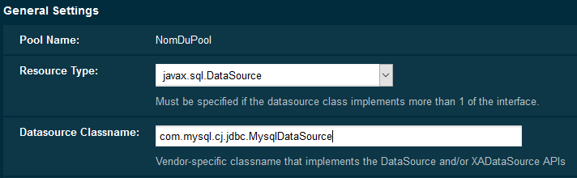
* sauver
* dans "Additional Properties", ajouter les différentes propriétés :
  * serverTimezone n'est pas nécessairement obligatoire

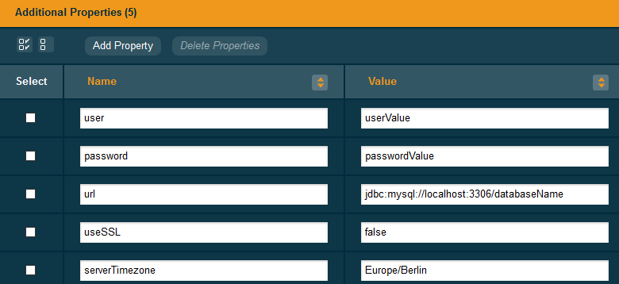
* sauver à nouveau
* retourner sur "General"
* faire un test de ping
* si ceci apparait 

* c'est bon? sinon recommencer 

* aller dans JDBC Ressource
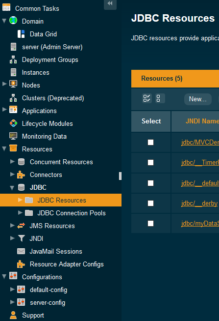
* cliquer sur new
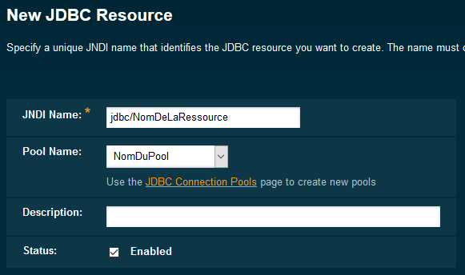
  * le Pool Name est celui précédemment créé
  * le JNDI Name doit être le même que celui se trouvant dans "persistence.xml" du projet
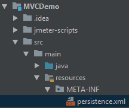 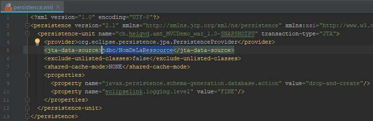

* rerun payara et normalement c'est bon !!!